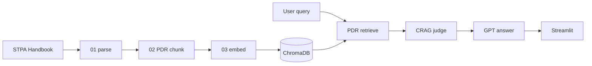
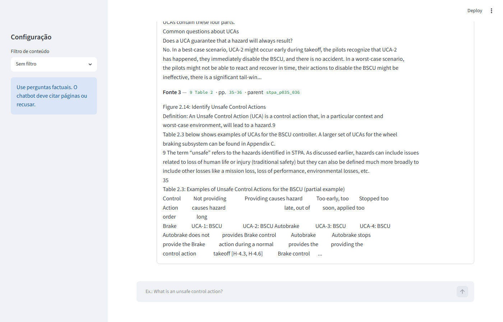
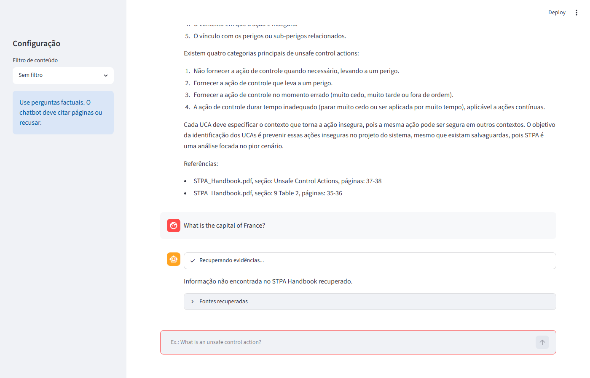

<p align="center">
  
  
  
  
  
</p>

<h1 align="center">STPA Handbook RAG Chatbot</h1>

<p align="center">
  Parent Document Retrieval · ChromaDB · CRAG · Streamlit<br/>
  <em>Laboratório TE-251 Aula 11 — Q&A factual ancorado ao STPA Handbook</em>
</p>

<p align="center">
  <a href="#quick-start">Quick Start</a> ·
  <a href="#architecture">Architecture</a> ·
  <a href="#evidence">Evidence</a> ·
  <a href="#documentation">Documentation</a> ·
  <a href="https://github.com/diegoluchetti/te251-ragavancado">GitHub</a>
</p>

---

## Overview

This repository delivers a **local RAG chatbot** grounded on the *STPA Handbook* PDF. It implements the TE-251 tutorial stack without LangChain:

| Layer | Implementation |
|-------|----------------|
| Ingestion | PDF → PDR chunking (89 parents / 321 children) |
| Embeddings | OpenAI `text-embedding-3-small` (OpenRouter fallback) |
| Vector store | ChromaDB (persistent, cosine) |
| Retrieval | Parent Document Retrieval + CRAG judge |
| Generation | OpenAI `gpt-4.1-mini` (OpenRouter fallback) |
| UI | Streamlit @ `localhost:8501` |

All 11 functional requirements are **verified** with traceable evidence.

## Repository layout

```
rag-avancado/
├── lab_stpa_rag_chatbot/     ← Application code & pipeline scripts
│   ├── app/                  ← rag_core.py, streamlit_app.py
│   ├── scripts/              ← 00_doctor … 04_smoke, capture_screenshots
│   ├── evals/                ← 05_run_eval.py + eval_questions.jsonl
│   └── data/                 ← raw PDF, parsed JSONL, Chroma index
├── rag-avancado/             ← Obsidian engineering vault
│   ├── index.md              ← Vault hub (RTM, architecture, evidence)
│   └── development/evidence/ ← Delivery screenshots
├── docs/                     ← Reference PDFs (Handbook, tutorial, Aula 11)
├── .env.example              ← API keys template (copy to .env)
└── README.md                 ← You are here
```

## Quick start

### 1. Configure API keys

Copy the template and add your keys at the **repo root**:

```powershell
copy .env.example .env
```

```env
OPEN_AI_API_KEY=sk-...
OPENROUTER_API_KEY=sk-or-...    # used when OpenAI is unreachable
```

### 2. Install & run pipeline

```powershell
cd lab_stpa_rag_chatbot
python -m venv .venv
.\.venv\Scripts\Activate.ps1
pip install -r requirements.txt

python scripts/00_doctor.py
python scripts/01_parse_pdf.py
python scripts/02_build_parent_child.py
python scripts/03_embed_index.py
```

### 3. Launch the chatbot

```powershell
$env:PYTHONPATH="app"
streamlit run app/streamlit_app.py
```

Open **http://localhost:8501** and ask factual STPA questions.

### 4. Validate

```powershell
$env:PYTHONPATH="."
python scripts/04_smoke_test_retriever.py
python evals/05_run_eval.py
```

## Architecture



**Parent Document Retrieval:** children are embedded and searched; matching **parent** sections are passed to the LLM as full context.

**CRAG:** `judge_retrieval()` validates retrieval quality before generation; insufficient evidence triggers an explicit refusal.

See the full diagram in the [Obsidian vault](rag-avancado/architecture.md).

## Evidence

| Artifact | Path | Proves |
|----------|------|--------|
| Chunk report | `lab_stpa_rag_chatbot/data/parsed/chunk_report.txt` | 89 parents / 321 children |
| Eval output | `lab_stpa_rag_chatbot/eval_output.txt` | q01–q05 automated tests |
| In-scope UI | `rag-avancado/development/evidence/in-scope.png` | Citations + Fontes recuperadas |
| Out-of-scope UI | `rag-avancado/development/evidence/out-of-scope.png` | Explicit refusal |

<p align="center">
  
  &nbsp;
  
</p>

## Documentation

Open the **Obsidian vault** at [`rag-avancado/`](rag-avancado/) for full engineering docs:

| Document | Description |
|----------|-------------|
| [index.md](rag-avancado/index.md) | Vault hub |
| [requirements.md](rag-avancado/requirements.md) | Functional & delivery requirements |
| [architecture.md](rag-avancado/architecture.md) | System design & data flow |
| [rtm.md](rag-avancado/rtm.md) | Requirement traceability matrix |
| [evidence.md](rag-avancado/evidence.md) | Verification artifacts index |
| [runbook.md](rag-avancado/runbook.md) | Operational guide |
| [design-decisions.md](rag-avancado/design-decisions.md) | DD-001 … DD-006 |
| [log.md](rag-avancado/log.md) | Implementation history |

Reference PDFs live in [`docs/`](docs/).

## API providers

The app tries providers in order:

1. **OpenAI** — primary (`text-embedding-3-small`, `gpt-4.1-mini`)
2. **OpenRouter** — automatic fallback when OpenAI is unreachable
3. **Offline** — optional dev mode (`ALLOW_OFFLINE_EMBED=1`, BGE-M3 + Ollama)

Keys are loaded from the repo root `.env` via `app/env_config.py`.

## License

[MIT](LICENSE) © 2026 Diego Rego

---

<p align="center">
  <sub>TE-251 · RAG Avançado · STPA Handbook Lab</sub>
</p>
