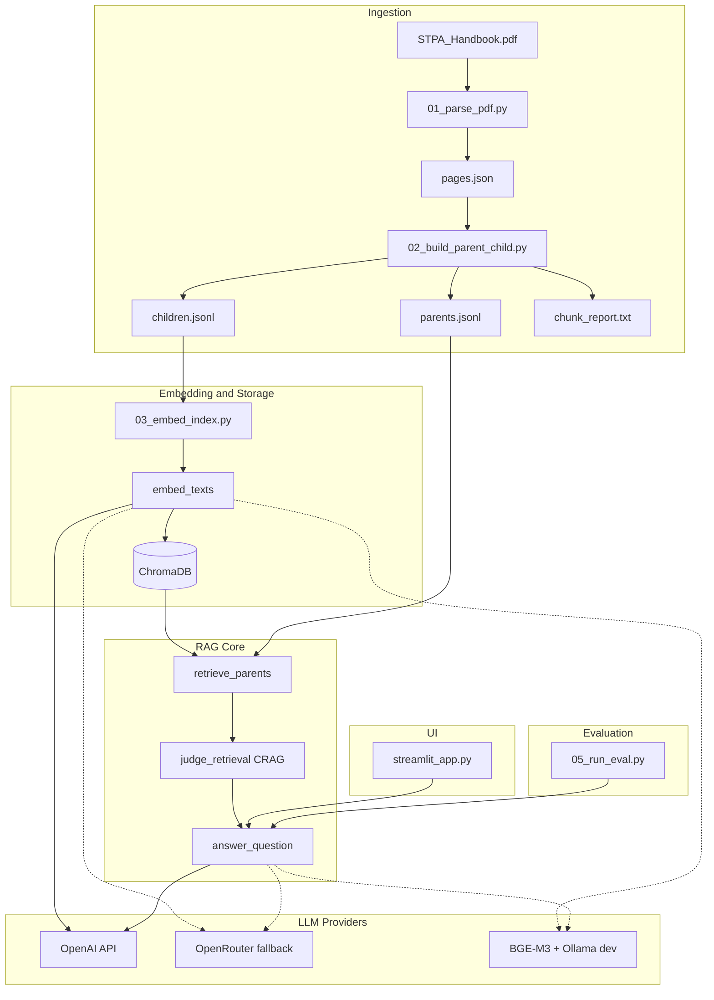

# Architecture

## Visão geral

## Parent Document Retrieval (PDR)

1. **Children** (321) — chunks pequenos indexados no ChromaDB para busca semântica.
2. **Parents** (89) — seções completas em `parents.jsonl`; retornadas ao LLM como contexto.
3. **Query flow:** embed query → top-k children → deduplicate by `parent_id` → fetch parent text → format context.

## CRAG (Corrective RAG)

`judge_retrieval()` classifica a recuperação como `correct`, `ambiguous` ou `incorrect` antes de gerar a resposta. Se `incorrect`, uma segunda busca (n_results=16) é tentada; persistindo incorreto → mensagem de recusa.

## Configuração de ambiente

Carregamento em `app/env_config.py`:

1. `lab_stpa_rag_chatbot/.env` (overrides locais)
2. `rag-avancado/.env` (chaves API — **prevalece**)

Variáveis principais: `OPEN_AI_API_KEY`, `OPENROUTER_API_KEY`, `ALLOW_OFFLINE_EMBED`.

## Stack

| Camada | Tecnologia |
|--------|------------|
| PDF parsing | pypdf |
| Embeddings | OpenAI `text-embedding-3-small` |
| Vector store | ChromaDB (cosine, persistent) |
| Chat | OpenAI `gpt-4.1-mini` |
| UI | Streamlit |
| Fallback | OpenRouter (`openai/*` models) |

Sem LangChain ([[design-decisions#DD-002]]).
