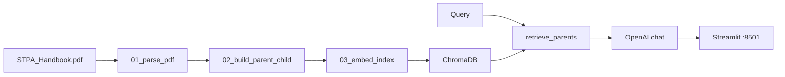

# STPA Handbook RAG — Implementation Plan (ponytail-reviewed)

## Ponytail install (done)

- Skill: `~/.agents/skills/ponytail` via `npx skills add DietrichGebert/ponytail@ponytail`
- Cursor rule: [`.cursor/rules/ponytail.mdc`](rag-avancado/.cursor/rules/ponytail.mdc) (`alwaysApply: true`)
- Review skill: `~/.agents/skills/ponytail-review`

## Ponytail-review of the previous plan

Applied [ponytail-review](https://github.com/DietrichGebert/ponytail) format to the draft plan (complexity-only pass):

| Finding | Tag | Cut | Replace with |
|---------|-----|-----|--------------|
| 7 waves (0–6) | `yagni` | Waves 0, 5, 6 as separate phases | **3 delivery waves** + 1 optional CRAG |
| Wave 6 GraphRAG (`05_build_graph.py`, `graph_retriever.py`, hybrid retrieval) | `delete` | Entire wave from active plan | DD entry “deferred”; Aula 11 says PDR first |
| `app/crag.py` new module | `yagni` | Separate file | One `judge_retrieval()` in `rag_core.py` (~30 lines) |
| Vault: `requirements/`, `specs/`, `verification/`, `validation/` trees | `shrink` | 6+ folders before code exists | **5 vault files** + `development/prompts/` (Starting Prompt mandates RTM, not folder count) |
| Migrate nested Obsidian → `vault/` | `delete` | Extra migration step | Keep **existing** Obsidian at [`rag-avancado/rag-avancado/`](rag-avancado/rag-avancado/) (has `.obsidian/`); add `lab_stpa_rag_chatbot/` sibling to `docs/` at repo root |
| Re-document rag-exercicio methodology | `yagni` | Copy patterns from sibling repo | One-line links in `log.md` / DD only |
| Extend eval to ~10 questions in Wave 4 | `yagni` | Extra questions beyond tutorial | Tutorial minimum **q01–q04**; add more only if RTM gap |
| CRAG in baseline architecture diagram | `shrink` | CRAG node in Wave 1–3 mermaid | Baseline diagram = PDR only; CRAG noted as optional Wave 4 |
| `sample_pages.txt` manual artifact | `delete` | Extra file | Inspect `pages.json` directly (tutorial allows either) |
| LangChain / ParentDocumentRetriever wrapper | `stdlib`/`yagni` | Not in old plan — keep it out | Tutorial uses **openai + chromadb + pypdf** only — no LangChain |

**net: ~40% less planned files and 4 fewer integration commits before delivery.**

Safety kept (ponytail “never lazy about”): OpenAI key in `.env`, explicit refusal prompt, smoke test + `05_run_eval.py`, RTM + evidence screenshots — all stay.

---

## Current state

| Asset | Location |
|-------|----------|
| Requirements | [`rag-avancado/rag-avancado/Starting Prompt.md`](rag-avancado/rag-avancado/Starting Prompt.md) |
| Tutorial (canonical code spec) | [`docs/Tutorial_RAG_Customizada_STPA_Streamlit_2026-1.pdf`](rag-avancado/docs/Tutorial_RAG_Customizada_STPA_Streamlit_2026-1.pdf) |
| Course slides (CRAG/GraphRAG theory) | [`docs/TE-251_Aula11_RAG_Avancado.pdf`](rag-avancado/docs/TE-251_Aula11_RAG_Avancado.pdf) |
| Handbook | [`docs/STPA_Handbook.pdf`](rag-avancado/docs/STPA_Handbook.pdf) |
| Code | **Not started** |
| Remote | [te251-ragavancado](https://github.com/diegoluchetti/te251-ragavancado) |

**Scope:** Starting Prompt functional requirements = **tutorial PDR baseline (Waves 1–3)**. Project title “Corrective RAG / Graph RAG” = **Wave 4 optional CRAG only**; GraphRAG = documented deferral (Aula 11: next step after PDR, not substitute).

---

## Target layout (minimal)

```
rag-avancado/                      # repo root → te251-ragavancado (Cursor workspace)
  .cursor/rules/ponytail.mdc
  docs/                            # PDFs (already here)
  lab_stpa_rag_chatbot/            # tutorial project (to create)
    data/raw/STPA_Handbook.pdf     # copy from docs/ once
    data/parsed/                   # pages.json, *.jsonl, chunk_report.txt
    data/index/chroma/             # gitignored
    scripts/00..04_*.py
    app/rag_core.py, streamlit_app.py
    evals/eval_questions.jsonl, 05_run_eval.py
    requirements.txt, .env.example, .gitignore
  rag-avancado/                    # Obsidian vault (existing .obsidian/)
    Starting Prompt.md
    index.md, log.md, rtm.md, design-decisions.md   # add in Wave 1
    development/prompts/
    development/evidence/          # screenshots
```

ponytail: **no** `vault/` rename, **no** duplicate PDF strategy doc — README one paragraph for copy step.

---

## Baseline architecture (Waves 1–3)



PDR: embed children → query top-k → dedupe `parent_id` → send parent text + metadata.

Refusal (required, Wave 2): system prompt — *"Informação não encontrada no STPA Handbook recuperado."* when context empty/weak.

---

## Environment

From tutorial Appendix B — **no extra deps**:

```
openai>=1.40.0
chromadb>=0.5.0
streamlit>=1.36.0
python-dotenv>=1.0.1
pypdf>=4.3.0
tiktoken>=0.7.0
rich>=13.7.1
```

`.env`: `OPENAI_API_KEY`, `OPENAI_CHAT_MODEL` (gpt-4.1-mini → fallback gpt-4o-mini), `OPENAI_EMBED_MODEL=text-embedding-3-small`, `CHROMA_PATH`, `COLLECTION_NAME`, `MAX_PARENTS=3`.

Implement scripts **`00`–`04`, `rag_core.py`, `streamlit_app.py`, `05_run_eval.py` per tutorial Appendix A–J** — copy/adapt appendix code; do not re-design.

Key `02_build_parent_child.py` constants: `PAGES_PER_PARENT=2`, `CHILD_WORDS=280`, `OVERLAP_WORDS=45`, `guess_section()` + `SECTION_HINTS`, `detect_chunk_type()`.

---

## Waves (ponytail-compressed)

### Wave 1 — Scaffold + ingestion

**Build:**
1. `lab_stpa_rag_chatbot/` tree + `.gitignore` + `requirements.txt` + `.env.example`
2. Copy `docs/STPA_Handbook.pdf` → `data/raw/`
3. `scripts/01_parse_pdf.py`, `scripts/02_build_parent_child.py` → `chunk_report.txt`
4. Obsidian minimum (Starting Prompt mandate):
   - [`rag-avancado/rag-avancado/index.md`](rag-avancado/rag-avancado/index.md) — links
   - [`rag-avancado/rag-avancado/rtm.md`](rag-avancado/rag-avancado/rtm.md) — REQ-01..11 → script → evidence
   - [`rag-avancado/rag-avancado/design-decisions.md`](rag-avancado/rag-avancado/design-decisions.md) — DD-001 PDR, DD-002 no LangChain, DD-003 GraphRAG deferred
   - [`rag-avancado/rag-avancado/log.md`](rag-avancado/rag-avancado/log.md) — append wave result + chunk counts
   - [`rag-avancado/rag-avancado/development/prompts/`](rag-avancado/rag-avancado/development/prompts/) — this session
5. Git init remote `te251-ragavancado`; commit + push

**Verify:** `chunk_report.txt` shows parents + children counts.

---

### Wave 2 — Index + RAG core

**Build:** `03_embed_index.py`, `app/rag_core.py`, `scripts/00_doctor.py`, `scripts/04_smoke_test_retriever.py`

**Verify:**
- Chroma collection count > 0
- Smoke test returns ≥1 parent with section/pages
- `00_doctor.py` no critical MISS

Update `log.md` + RTM rows for REQ-04..07. Commit + push.

---

### Wave 3 — UI + eval + delivery evidence

**Build:** `app/streamlit_app.py` (Fontes recuperadas expander, chunk_type filter), `evals/eval_questions.jsonl` (q01–q04), `evals/05_run_eval.py`

**Verify (mandatory deliverables):**
```powershell
cd lab_stpa_rag_chatbot
$env:PYTHONPATH="app"; streamlit run app/streamlit_app.py   # localhost:8501
$env:PYTHONPATH="."; python evals/05_run_eval.py *> eval_output.txt
```
- Screenshot: in-scope query + expanded Fontes → `development/evidence/in-scope.png`
- Screenshot: out-of-scope refusal → `development/evidence/out-of-scope.png`
- RTM all rows **verified**. Commit + push.

ponytail: evidence PNGs in one folder, not per-wave verification/*.md files.

---

### Wave 4 — CRAG optional (title alignment only)

**Only after Wave 3 checklist green.**

Add to `rag_core.py` (not a new module):

```python
def judge_retrieval(question: str, context: str) -> str:
    # LLM → "correct" | "ambiguous" | "incorrect" (tutorial §14)
```

Wire into `answer_question()`: on `incorrect` after one re-query → same refusal string. Optional: log verdict in result dict.

ponytail: **no** web search, **no** `eval_edge_cases.jsonl` unless eval fails — extend `eval_questions.jsonl` with 1 off-topic line instead.

GraphRAG: **do not implement** in this lab delivery. Record DD-004 “GraphRAG deferred; PDR + CRAG sufficient for STPA factual Q&A per Aula 11”.

---

## RTM (summary)

| ID | Requirement | Artifact | Evidence |
|----|-------------|----------|----------|
| REQ-01 | Ingest PDF | `01_parse_pdf.py` | `pages.json` |
| REQ-02 | PDR chunking | `02_build_parent_child.py` | `chunk_report.txt` |
| REQ-03 | Metadata tags | children jsonl | UI Fontes |
| REQ-04 | text-embedding-3-small | `03_embed_index.py` | Chroma count |
| REQ-05 | Chroma local | `data/index/chroma/` | smoke test |
| REQ-06 | Retrieve chunks | `retrieve_parents` | smoke test |
| REQ-07 | Section/page in answer | system prompt | screenshot |
| REQ-08 | Refusal | prompt (+ CRAG Wave 4) | out-of-scope screenshot |
| REQ-09–10 | Streamlit + Fontes | `streamlit_app.py` | in-scope screenshot |
| REQ-11 | Eval script | `05_run_eval.py` | `eval_output.txt` |

Full matrix: [`rag-avancado/rag-avancado/rtm.md`](rag-avancado/rag-avancado/rtm.md).

---

## Process (unchanged intent, fewer files)

After each wave:
1. Read Obsidian docs in [`rag-avancado/rag-avancado/`](rag-avancado/rag-avancado/) first
2. Run verify commands
3. Append [`log.md`](rag-avancado/rag-avancado/log.md) + update [`rtm.md`](rag-avancado/rag-avancado/rtm.md)
4. Commit + push `te251-ragavancado`
5. Save prompts under `development/prompts/`

---

## Definition of done

- [ ] Tutorial checklist K (doctor, chunk_report, Chroma, smoke, Streamlit, refusal, eval)
- [ ] Starting Prompt screenshots + `eval_output.txt`
- [ ] Obsidian: requirements trace in `rtm.md`, DD, log, prompts
- [ ] Ponytail constraint: no LangChain, no GraphRAG code, no extra abstraction layers
- [ ] Pushed to `te251-ragavancado`

---

## Risks (trimmed)

| Risk | Mitigation |
|------|------------|
| Bad PDF extract | Inspect `pages.json`; Docling only if tables block delivery |
| Model name drift | `.env` fallback gpt-4o-mini |
| Scope creep (GraphRAG) | Deferred by design (DD-003) |
| Over-documentation | RTM + log only; skip parallel verification/*.md per wave |
